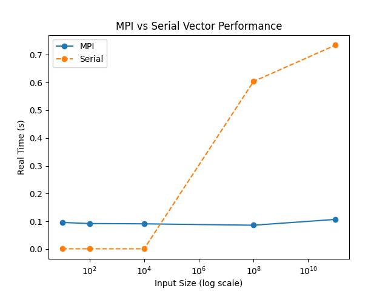

# RESULTS - Topic 3: MPI Introduction

## MPI Hello World Performance
| Input Size | Real Time (s) | User Time (s) | Sys Time (s) |
| ---------- | ------------- | ------------- | ------------ |
| np2        | 0.098         | 0.037         | 0.121        |
| np4        | 0.115         | 0.060         | 0.272        |

## MPI Vector Performance

| Input Size      | Real Time (s) | User Time (s) | Sys Time (s) |
| --------------- | ------------- | ------------- | ------------ |
| 10              | 0.096         | 0.016         | 0.067        |
| 100             | 0.092         | 0.023         | 0.055        |
| 10,000          | 0.091         | 0.017         | 0.058        |
| 100,000,000     | 0.086         | 0.016         | 0.057        |
| 100,000,000,000 | 0.107         | 0.020         | 0.070        |

## Serial Vector Performance

| Input Size      | Real (s) | User (s) | Sys (s) |
| --------------- | -------- | -------- | ------- |
| 10 - 10,000     | 0.001    | 0.001    | 0.001   |
| 100,000,000     | 0.604    | 0.352    | 0.243   |
| 100,000,000,000 | 0.735    | 0.482    | 0.326   |

##  Comparison Insights
### MPI vs Serial Scaling

Graph showing the stage where serial becomes slower at completing task

MPI remains relatively stable across input sizes (~0.086–0.107s)
Serial execution grows significantly with input size
MPI clearly outperforms serial for large datasets
Serial is faster only for very small inputs (≤10,000)
### Performance Summary
Input Size Range	Faster Method	Reason
Small (≤10,000)	Serial	No communication overhead
Medium (100k)	MPI	Parallel workload benefit begins
Large (100M+)	MPI	Strong scalability advantage
Very large (100B)	MPI	Serial becomes impractical
##  Observations
MPI reduces runtime variability across input sizes
Serial execution scales poorly with large datasets
Communication overhead in MPI is hidden at large scale
System time increases in parallel execution due to message passing
Overall Conclusion

The results clearly demonstrate that MPI provides strong performance advantages for large-scale vector computations. While serial execution is efficient for small workloads, it becomes impractical as input size grows.

MPI achieves stable execution times due to distributed workload handling, confirming its suitability for high-performance computing applications.