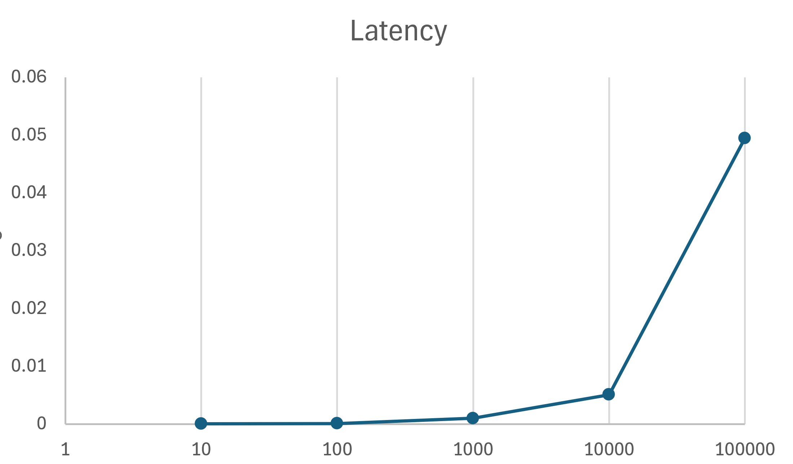
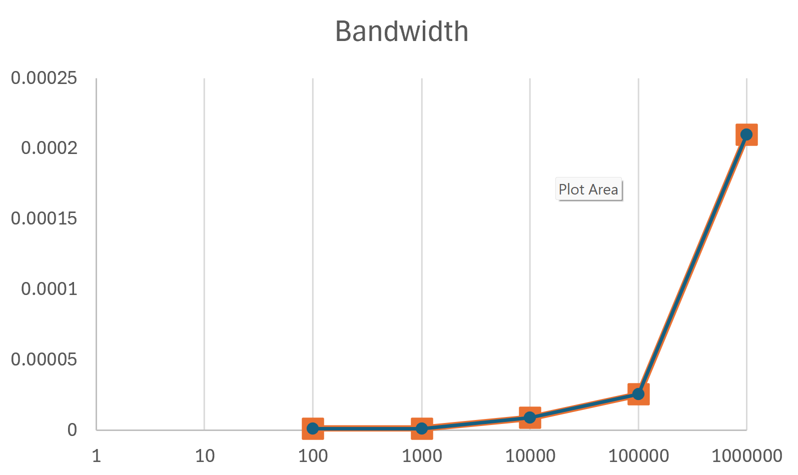

# RESULTS - Topic 4: MPI Communications 

## Latency Results (Ping-Pong))
| Num Pings | Total Time (s) | Avg Time (s) |
|-----------|----------------|--------------|
| 10        | 0.000035       | 3.47e-06     |
| 100       | 0.000102       | 1.02e-06     |
| 1000      | 0.001012       | 1.01e-06     |
| 10000     | 0.005095       | 5.09e-07     |
| 100000    | 0.049473       | 4.95e-07     |

## Observation
Average time decreases and stabilises as iterations increase

Stable latency ≈ 5 × 10⁻⁷ seconds. 

Total time increases linearly with number of pings
## Bandwidth Results (Array Transfer)
Message Size (B) | Avg Time (s) | Bandwidth (B/s)
-------------------------------------------------
| Message Size (B) | Avg Time (s) | Bandwidth (B/s) |
|------------------|-------------|-----------------|
| 100              | 1.17e-06    | 8.58e+07        |
| 1000             | 1.09e-06    | 9.16e+08        |
| 10000            | 8.90e-06    | 1.12e+09        |
| 100000           | 2.56e-05    | 3.91e+09        |
| 1000000          | 2.10e-04    | 4.76e+09        |

## Observation
Bandwidth increases with message size

Small messages are dominated by latency

Large messages approach maximum bandwidth
## Key Observations
Latency stabilises only after many iterations

Small messages → latency dominates

Large messages → bandwidth dominates

MPI overhead becomes less significant for larger data sizes
## Overall Conclusion

MPI communication performance depends on message size.
Latency dominates for small messages, while bandwidth determines performance for larger transfers.

The ping-pong benchmark clearly demonstrates how communication cost scales and provides a simple method to measure both latency and bandwidth.